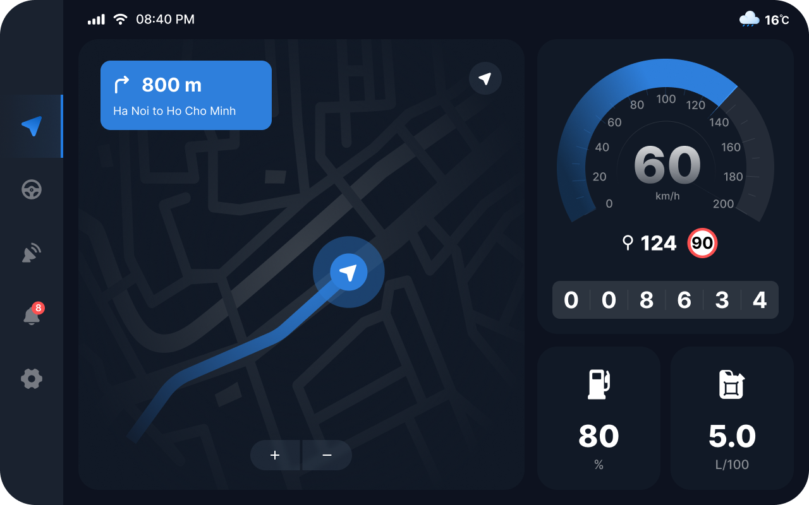
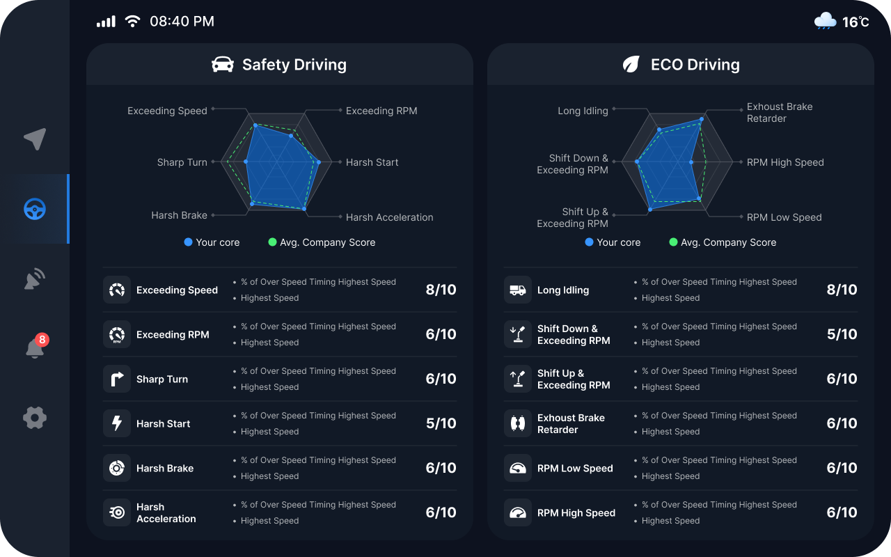
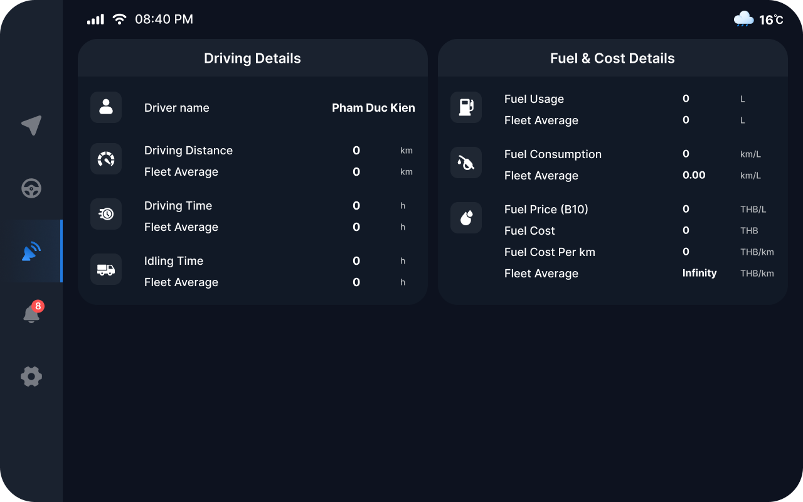
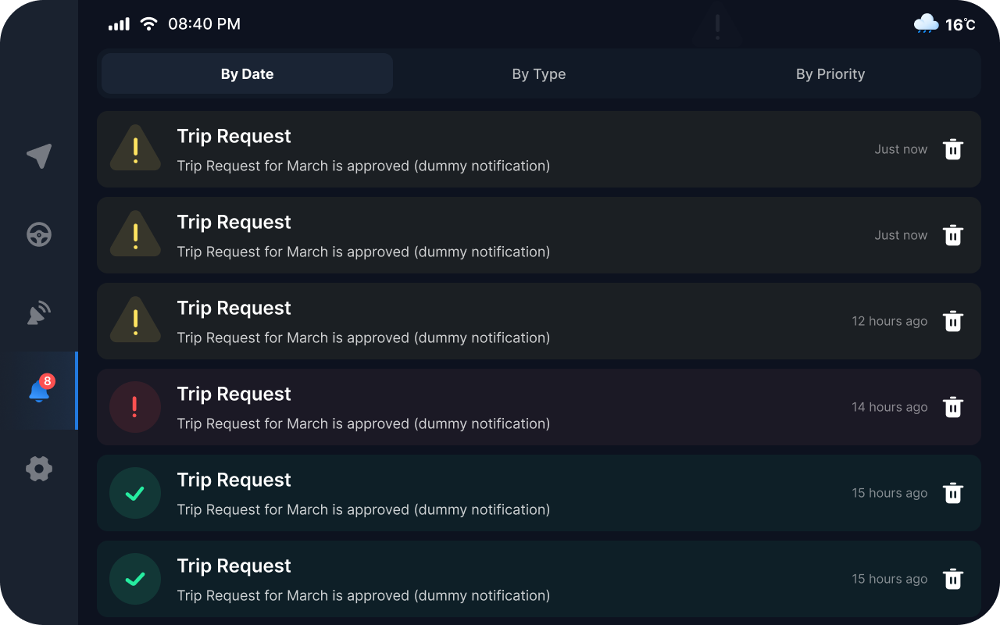
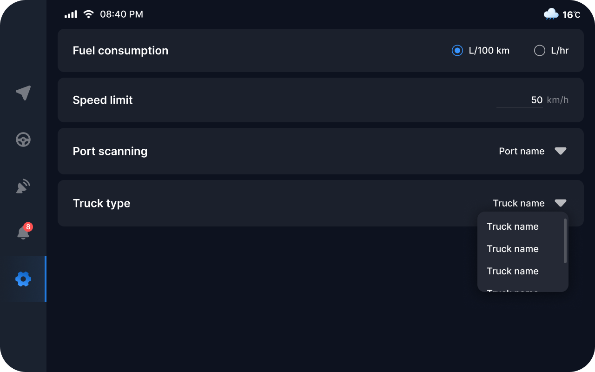

# Android HeadUnit Display for Android Automotive OS
<h1 align="center">

</h1>

## Main feature
1. Serial connection communicate for car data by realtime
2. Offline map display for positioning
3. Data storage with Room (SQLite)
4. Visualize data by column
5. Responsive config for 10 inchs display

# Getting started

Open in Android Studio, click on `Run`. Design: [Figma](https://figma.com/) 

Result image:
<h1 align="center">

</h1>